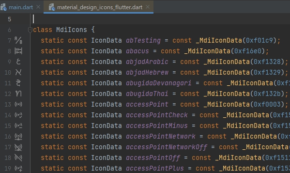

# Flutter MdiIcons Previewer Plugin

+ A JetBrains IDE Plugin for previewing `material_design_icons_flutter` icons (MdiIcons) in code line gutter and code completion suggestion list.
+ Develop environment: `IntelliJ IDEA 2022.2.3` `JDK 11 / Kotlin 1.7.10` `Flutter 2.10.5 channel stable / Dart 2.16.2`

### Build

```bash
cd flutter_mdi_plugin

# 1. Prepare icon resources
cd tool
flutter run -d windows # wait for saving properties file and icon images
# Exit the generator by pressing <q>, or close the window directly

# 2. Build plugin
cd ..
gradle -q buildPlugin
# Built jar file can be found in ./build/libs/
```

### Install

+ Download the prebuilt jar file from [Release Page](https://github.com/Aoi-hosizora/flutter_mdi_plugin/releases), or build it manually.
+ Install the plugin to JetBrains IDE through `Install Plugin from Disk` Option.


### Screenshot

|  |  |    |
|------------------------------------------|------------------------------------------|--------------------------------------------|
| Preview icons in code line gutter        | Preview icons in suggestion list         | Preview icons in mdi package's source code |

### Why do I develop this plugin?

+ The [official flutter plugin](https://github.com/flutter/flutter-intellij) can not preview mdi icons, which is feedback in [flutter-intellij's issue](https://github.com/flutter/flutter-intellij/pull/5595#issuecomment-880205412) and [material_design_icons_flutter's issue](https://github.com/ziofat/material_design_icons_flutter/issues/7).
+ The published [flutter enhancement suite](https://github.com/marius-h/flutter_enhancement_suite) plugin always throws exception when trying to preview icons, although its [newest commit](https://github.com/marius-h/flutter_enhancement_suite/commit/969a690a3b649e3d73e3c237d26cd341a1439856) can preview icons successfully, but it still throws exceptions at other features.

### Reference

+ [marius-h/flutter_enhancement_suite](https://github.com/marius-h/flutter_enhancement_suite)
+ [Custom Language Support Tutorial - Annotator](https://plugins.jetbrains.com/docs/intellij/annotator.html)
+ [Custom Language Support Tutorial - Completion Contributor](https://plugins.jetbrains.com/docs/intellij/completion-contributor.html)
